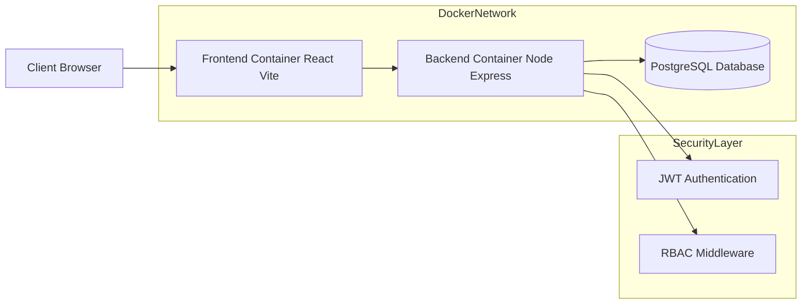
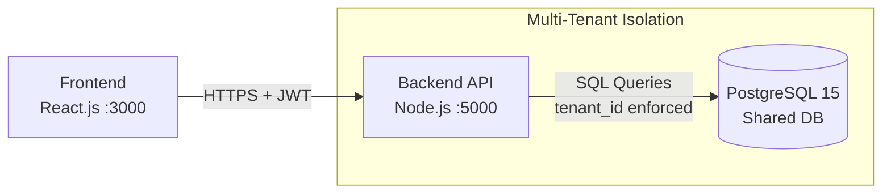
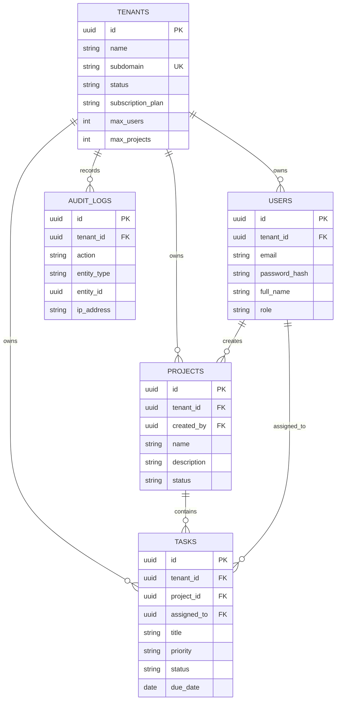

# System Architecture Document

**Project Title:** Multi-Tenant SaaS Project Management System  
**Date:** October 26, 2025  
**Version:** 1.0  
**Author:** AWS Student / Lead Developer  

---

## 1. System Architecture Design

The platform uses a **containerized three-tier web architecture** that emphasizes modular design, horizontal scalability, and strong tenant isolation. [web:1][web:12]  
All services are orchestrated using **Docker Compose**, providing a consistent runtime environment for both local development and production deployments. [web:4]

---

## High-Level Architecture Diagram



## System Architecture & Components

The solution adopts a **multi-tenant, container-based architecture** with clear separation of concerns between the **client UI**, **backend API**, and **persistent data storage** layers. [web:1][web:11]

---

## Components Description

### Client Layer (Frontend)

- **Technology Stack:** React.js (bundled with Vite)
- **Container Port Mapping:** `3000 (Host) → 3000 (Container)`
- **Core Responsibilities:**
  - Render the user-facing interface and views
  - Capture and respond to user interactions
  - Store and manage authentication tokens (JWT)
  - Communicate with the backend via REST API calls
- **Multi-Tenant Handling:**
  - Determines tenant context using:
    - Subdomain conventions (e.g., `tenant1.app.com`), or
    - Explicit tenant selection / input on the login screen

---

### Application Layer (Backend API)

- **Technology Stack:** Node.js with Express.js
- **Container Port Mapping:** `5000 (Host) → 5000 (Container)`
- **Core Responsibilities:**
  - Execute domain and business logic
  - Handle authentication using JWT-based flows
  - Enforce authorization using RBAC middleware
  - Guarantee that each request is scoped to the correct tenant
- **Tenant Isolation Mechanism:**
  - Middleware reads `tenant_id` from the JWT claims
  - Adds `tenant_id` into the data-access context for all queries
  - Ensures all operations are filtered by tenant, preventing cross-tenant access [web:12][web:13]

---

### Data Layer (Database)

- **Technology:** PostgreSQL 15
- **Container Port Mapping:** `5432 (Host) → 5432 (Container)`
- **Core Responsibilities:**
  - Provide durable relational storage for all application entities
- **Multi-Tenant Strategy:**
  - Uses a **single database with a shared schema** design
  - Applies logical separation by including a `tenant_id` discriminator on tenant-owned tables
  - Every tenant-scoped table includes `tenant_id` to support row-level isolation patterns [web:12][web:15]

---

## High-Level System Architecture (Mermaid)



---

## Database Schema Design (ERD)

The relational model is designed to meet **Third Normal Form (3NF)**, minimizing redundancy and maintaining referential integrity across entities. [web:15]  
The `tenant_id` attribute serves as the **logical partition key**, enabling secure segregation of records in a **shared-database, shared-schema** multi-tenant configuration. [web:12]



---

## Schema Details

### `tenants` (Root Entity)

- **Primary Key:** `id (UUID)`
- **Business Fields:**
  - `name`
  - `subdomain` (unique per tenant)
  - `status`
  - `subscription_plan`
- **Limit Fields:**
  - `max_users`
  - `max_projects`
- **Isolation Notes:**
  - Acts as the top-level entity; does not contain a `tenant_id` column itself

---

### `users`

- **Primary Key:** `id (UUID)`
- **Foreign Key Relationships:**
  - `tenant_id → tenants.id` (`ON DELETE CASCADE`) **[TENANT BOUNDARY]**
- **Business Fields:**
  - `email`
  - `password_hash`
  - `full_name`
  - `role`
- **Constraints:**
  - `UNIQUE (tenant_id, email)`  
    Ensures email addresses are unique within the scope of a single tenant

---

### `projects`

- **Primary Key:** `id (UUID)`
- **Foreign Key Relationships:**
  - `tenant_id → tenants.id` (`ON DELETE CASCADE`) **[TENANT BOUNDARY]**
  - `created_by → users.id`
- **Business Fields:**
  - `name`
  - `description`
  - `status`
- **Indexing:**

```sql
CREATE INDEX idx_projects_tenant ON projects(tenant_id);
```

---

### `tasks`

- **Primary Key:** `id (UUID)`
- **Foreign Key Relationships:**
  - `project_id → projects.id` (`ON DELETE CASCADE`)
  - `tenant_id → tenants.id` **[TENANT BOUNDARY]**
  - `assigned_to → users.id` (nullable to allow unassigned tasks)
- **Business Fields:**
  - `title`
  - `priority`
  - `status`
  - `due_date`
- **Indexing:**

```sql
CREATE INDEX idx_tasks_tenant ON tasks(tenant_id);
```

---

### `audit_logs`

- **Primary Key:** `id (UUID)`
- **Foreign Key Relationships:**
  - `tenant_id → tenants.id` **[TENANT BOUNDARY]**
- **Business Fields:**
  - `action`
  - `entity_type`
  - `entity_id`
  - `ip_address`

---

## API Architecture

The backend exposes **19 REST-style HTTP endpoints**, organized by responsibility and aligned with common REST API design practices for multi-tenant platforms. [web:13][web:16]

### Standard API Response Format

All endpoints return data using a consistent response envelope:

```json
{
  "success": true,
  "message": "Operation completed successfully",
  "data": {}
}
```

---

### Module A: Authentication

| Method | Endpoint                      | Description                                  | Authentication Required | Role    |
|-------:|------------------------------|----------------------------------------------|--------------------------|---------|
| POST   | `/api/auth/register-tenant`  | Register a new organization and initial admin | No                       | Public  |
| POST   | `/api/auth/login`           | Authenticate and obtain a JWT                | No                       | Public  |
| GET    | `/api/auth/me`              | Retrieve context of the logged-in user       | Yes                      | Any     |
| POST   | `/api/auth/logout`          | Log out and clear client session token       | Yes                      | Any     |

---

### Module B: Tenant Management

| Method | Endpoint                       | Description                                      | Authentication Required | Role                      |
|-------:|--------------------------------|--------------------------------------------------|--------------------------|---------------------------|
| GET    | `/api/tenants`                 | Retrieve list of all tenants (system-wide)       | Yes                      | `super_admin`            |
| GET    | `/api/tenants/:tenantId`       | Fetch configuration for a specific tenant        | Yes                      | `super_admin` or `owner` |
| PUT    | `/api/tenants/:tenantId`       | Update tenant metadata or subscription settings  | Yes                      | `super_admin` or `tenant_admin` |

---

### Module C: User Management

| Method | Endpoint                          | Description                                      | Authentication Required | Role                      |
|-------:|------------------------------------|--------------------------------------------------|--------------------------|---------------------------|
| POST   | `/api/tenants/:tenantId/users`    | Create a new user within a tenant                | Yes                      | `tenant_admin`           |
| GET    | `/api/tenants/:tenantId/users`    | List users associated with a tenant              | Yes                      | Any tenant member        |
| PUT    | `/api/users/:userId`              | Edit a user profile or update role               | Yes                      | `tenant_admin` or self   |
| DELETE | `/api/users/:userId`              | Remove a user account from the tenant            | Yes                      | `tenant_admin`           |

---

### Module D: Project Management

| Method | Endpoint                          | Description                                      | Authentication Required | Role               |
|-------:|------------------------------------|--------------------------------------------------|--------------------------|--------------------|
| POST   | `/api/projects`                   | Create a new project                             | Yes                      | Any tenant member  |
| GET    | `/api/projects`                   | Retrieve all projects for the current tenant     | Yes                      | Any tenant member  |
| PUT    | `/api/projects/:projectId`        | Modify details of an existing project            | Yes                      | Creator or Admin   |
| DELETE | `/api/projects/:projectId`        | Permanently delete a project                     | Yes                      | Creator or Admin   |

---

### Module E: Task Management

| Method | Endpoint                                   | Description                                         | Authentication Required | Role              |
|-------:|---------------------------------------------|-----------------------------------------------------|--------------------------|-------------------|
| POST   | `/api/projects/:projectId/tasks`           | Add a new task inside the given project             | Yes                      | Any tenant member |
| GET    | `/api/projects/:projectId/tasks`           | Retrieve all tasks tied to a project                | Yes                      | Any tenant member |
| PATCH  | `/api/tasks/:taskId/status`                | Update only the status field of a specific task     | Yes                      | Any tenant member |
| PUT    | `/api/tasks/:taskId`                       | Perform a complete update on a task’s properties    | Yes                      | Any tenant member |
